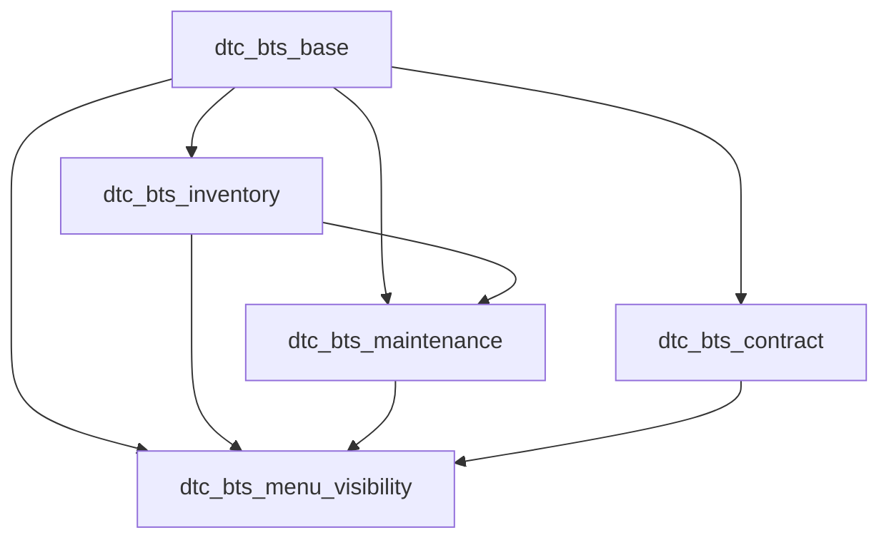

# Tổng quan hệ thống Odoo DTC BTS

> Kiểm tra theo working tree ngày 30/07/2026.

## Phạm vi hệ thống

Hệ thống mở rộng Odoo 17 để quản lý vòng đời dự án và trạm BTS, từ khởi
tạo dự án, hợp đồng, mua và cấp phát vật tư đến bàn giao vận hành, bảo trì
và sửa chữa.

## Các module custom

| Module | Chức năng |
| --- | --- |
| `dtc_bts_base` | Dữ liệu nền về dự án, trạm, đối tác và dashboard dự án |
| `dtc_bts_inventory` | Yêu cầu vật tư, mua hàng, nhập/xuất kho và dashboard kho |
| `dtc_bts_maintenance` | Bàn giao bảo trì, hồ sơ thiết bị, checklist và sửa chữa |
| `dtc_bts_contract` | Biên bản đàm phán, hợp đồng, gia hạn và hồ sơ bàn giao |
| `dtc_bts_menu_visibility` | Điều khiển việc hiển thị các ứng dụng Odoo gốc |

Quan hệ phụ thuộc chính:

## Dữ liệu dùng chung

- Dự án BTS dùng `project.project`.
- Trạm BTS dùng `project.task`.
- Đối tác dùng `res.partner`, phân loại thành nhà cung cấp, chủ đất, đối tác
  viễn thông, kỹ thuật viên thuê ngoài hoặc nhóm khác.
- Đơn mua dùng `purchase.order`.
- Phiếu nhập/xuất dùng `stock.picking` và `stock.move`.
- Hồ sơ thiết bị và phiếu bảo trì dùng model chuẩn của ứng dụng Maintenance.

Mã dự án, mã trạm và mã các chứng từ custom được sinh bằng sequence.

## Luồng nghiệp vụ tổng thể

1. GĐXN tạo dự án BTS, phân công KSGS; KSGS tạo và cập nhật danh sách trạm.
2. KSGS nhập HĐ thuê đất/BB đàm phán cho mọi trạm và gửi batch giai đoạn
   1; BGĐ ký đủ để đưa trạm sang `contracted`.
3. Tạo yêu cầu vật tư cho thi công; PKH duyệt và mua bổ sung nếu thiếu.
4. Thủ kho nhập hàng, tạo phiếu xuất từ yêu cầu. Hệ thống tự lấy sản phẩm
   và lượng duyệt còn lại, sau đó tự xác nhận/giữ hàng; Thủ kho vẫn phải
   Validate việc xuất thực tế.
5. Sau nghiệm thu, KSGS nhập HĐ cho thuê trạm và gửi batch giai đoạn 2;
   BGĐ ký đủ để đưa trạm sang `station_lease_signed`.
6. Khi trạm hoàn tất hồ sơ, KSGS bàn giao dự án sang bảo trì.
7. Tổ hạ tầng tiếp nhận, đưa trạm sang vận hành và tạo hồ sơ bảo trì. Lịch
   đầu tiên neo theo ngày nghiệm thu dự án, không neo theo ngày bàn giao.
8. Tạo phiếu bảo trì định kỳ, thực hiện checklist theo từng trạm.
9. Checklist lỗi sinh đề xuất sửa chữa; nếu cần vật tư thì đi qua luồng kho.
10. Hoàn tất sửa chữa sẽ đóng lỗi checklist và cập nhật lịch sử thiết bị.

## Dashboard

- Dashboard dự án: tổng dự án/trạm, cơ cấu Macro/Cell, tiến độ trạm, thông
  báo vật tư đã sẵn sàng và batch hợp đồng đã ký đủ cho KSGS.
- Dashboard cung ứng vật tư: KPI cấp đủ/thiếu nhập/chờ xuất, tiến độ theo
  công trình, trạng thái yêu cầu và bảng đối chiếu
  `Nhu cầu → Mua → Nhập → Xuất` theo từng vật tư.
- Dashboard bảo trì: KPI hư hỏng/chi phí, xu hướng theo tháng, xếp hạng
  tỉnh/hạng mục hay hỏng và các công việc bảo trì cần xử lý.
- Dashboard hợp đồng: phân tích mốc hết hạn, ma trận tỉnh × hạn, đối tác cần
  ưu tiên gia hạn, chênh lệch hạn hợp đồng đất–hạ tầng và công việc chờ xử lý.

Thông báo “Vật tư sẵn sàng cấp phát” nằm trên dashboard dự án, không nằm
trong dashboard kho.

## Vai trò

- Giám đốc Xí nghiệp (GĐXN)
- Kỹ sư giám sát (KSGS)
- Trưởng phòng Kế hoạch (TPKH)
- Thủ kho
- Tổ quản lý hạ tầng
- Group Quản lý nghiệp vụ chỉ còn là group kỹ thuật/dự phòng, không dùng
  trong luồng demo.
- Ban Giám đốc phụ trách hợp đồng
- Quản trị viên DTC BTS
- Odoo System Administrator
- Kỹ thuật viên thuê ngoài là đối tác nghiệp vụ, không mặc định là tài khoản
  nội bộ.

Chi tiết group, ACL, record rule, menu và quyền Administrator được mô tả
trong [06_phan_quyen_he_thong.md](06_phan_quyen_he_thong.md).

## Phân tách ứng dụng theo vai trò

| Tài khoản | Ứng dụng nghiệp vụ |
| --- | --- |
| Giám đốc Xí nghiệp | Quản lý dự án BTS |
| KSGS | Quản lý dự án BTS |
| Trưởng phòng Kế hoạch | Quản lý mua hàng và kho vật tư BTS |
| Thủ kho | Quản lý mua hàng và kho vật tư BTS |
| Tổ quản lý hạ tầng | Quản lý bảo trì trạm BTS, Quản lý hợp đồng BTS |
| Ban Giám đốc hợp đồng | Quản lý hợp đồng BTS |
| DTC Admin | Settings, không dùng ứng dụng nghiệp vụ |

Kỹ thuật viên thuê ngoài không có user Odoo. Kết quả từ form/sheet ngoài
hệ thống được Tổ hạ tầng kiểm tra và nhập lại vào Odoo.
