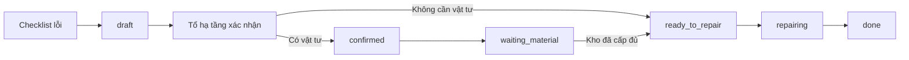

# Phân hệ bảo trì trạm BTS (`dtc_bts_maintenance`)

> Kiểm tra theo working tree ngày 30/07/2026.

## Phạm vi

Module quản lý bàn giao dự án sang vận hành, hồ sơ thiết bị theo trạm,
phiếu bảo trì định kỳ, checklist và đề xuất sửa chữa. Module phụ thuộc
`dtc_bts_inventory` để sử dụng chung luồng cấp phát vật tư.

## Bàn giao sang bảo trì

`project.project` được bổ sung trạng thái:

- `none`: chưa bàn giao.
- `pending`: chờ Tổ hạ tầng tiếp nhận.
- `accepted`: đã tiếp nhận bảo trì.

Luồng:

1. KSGS hoặc System Administrator bàn giao dự án khi dự án có trạm và mọi trạm đều ở
   `handover` hoặc `cancelled`.
2. Tổ hạ tầng hoặc System Administrator tiếp nhận dự án đang `pending`.
3. Dự án tự chuyển sang `handed_over` (**Hoàn tất bàn giao**).
4. Các trạm ở `handover` tự chuyển sang `operating` (**Vận hành**); trạm đã
   hủy vẫn giữ nguyên trạng thái.
5. Sau khi tiếp nhận, người dùng có thể tạo đồng loạt hồ sơ thiết bị cho
   các trạm và tạo phiếu bảo trì dự án.

Mốc bắt đầu để tính lịch bảo trì đầu tiên là `project.project.acceptance_date`
(ngày nghiệm thu dự án), không phải ngày bàn giao hoặc ngày tiếp nhận bảo trì.
Khi tạo hồ sơ đơn lẻ hoặc hàng loạt, `maintenance.equipment.effective_date`
được khóa theo mốc này. Nếu dự án chưa có ngày nghiệm thu, backend chặn tạo
hồ sơ. Ngày bảo trì đầu tiên bằng ngày nghiệm thu dự án cộng chu kỳ checklist
đang hoạt động ngắn nhất của loại trạm.

Các hồ sơ đã tạo trước khi áp dụng công thức này giữ giá trị đã lưu cho tới
khi được migration/tính lại; thay đổi source không tự sửa dữ liệu lịch sử.

## Model chính

- `maintenance.equipment`: hồ sơ thiết bị/trạm, ngày hiệu lực, ngày bảo trì
  kế tiếp, kỹ thuật viên, ngày và kết quả sửa gần nhất.
- `maintenance.request`: phiếu kiểm tra từng trạm thuộc một đợt bảo trì.
- `bts.maintenance.batch`: phiếu bảo trì cấp dự án.
- `bts.maintenance.checklist.item`: checklist mẫu theo loại trạm và chu kỳ.
- `bts.maintenance.checklist.result`: kết quả từng hạng mục, có cờ đã xử lý.
- `bts.repair.proposal`: hồ sơ điều phối sửa chữa.
- `bts.repair.proposal.line`: lỗi được lấy từ checklist.
- `bts.repair.proposal.material.line`: vật tư dự kiến cần cho sửa chữa.
- `bts.material.request`: được mở rộng để liên kết ngược với đề xuất và trạm.

## Phiếu bảo trì dự án

Trạng thái:

`draft` → `generated` → `in_progress` → `submitted` → `reviewed` → `done`.

`cancelled` dùng khi hủy phiếu.

Luồng:

1. Tạo phiếu cho dự án đã tiếp nhận và có hồ sơ thiết bị.
2. Sinh danh sách trạm và checklist theo loại trạm, chu kỳ 1/3/6 tháng.
3. Kỹ thuật viên kiểm tra từng trạm, nhập kết quả và số đo/ghi chú.
4. Hoàn tất từng trạm; trạm có lỗi được đánh dấu `failed`.
5. Gửi phiếu cho Tổ hạ tầng kiểm tra.
6. Tổ hạ tầng xác nhận kết quả.
7. Chỉ được hoàn tất phiếu khi các đề xuất sửa chữa liên quan đã kết thúc.
8. Hoàn tất phiếu cập nhật ngày bảo trì kế tiếp của thiết bị.

Chỉ hồ sơ thiết bị chưa bị lưu trữ (`active = True`) và có
`bts_state = active` mới được đưa vào phiếu bảo trì. Hồ sơ đã **Ngừng
quản lý** không tham gia tính hạn, dashboard hoặc danh sách trạm của phiếu
mới.

## Nhắc hạn bảo trì

Ngày cần bảo trì được lưu tại `maintenance.equipment.next_action_date`.
Hệ thống dùng `mail.activity` loại **To-do** để nhắc trước 3 ngày:

- Chỉ xét hồ sơ chưa bị lưu trữ, có trạm, có
  `bts_state = active` và có ngày bảo trì kế tiếp.
- Activity được tạo khi:
  `next_action_date <= ngày hiện tại + 3 ngày`.
- Deadline của activity là
  `next_action_date - 3 ngày`. Nếu ngày nhắc đã qua, deadline được đặt
  bằng ngày hiện tại.
- Ưu tiên giao activity cho **Người phụ trách bảo trì** trên hồ sơ thiết
  bị. Nếu chưa có người phụ trách đang hoạt động, activity được giao cho
  các người dùng đang hoạt động thuộc Tổ hạ tầng.
- Mỗi người chỉ có một activity nhắc hạn cho cùng hồ sơ; cron chạy lại
  không tạo bản trùng.
- Khi đổi ngày bảo trì kế tiếp, người phụ trách hoặc trạng thái quản lý,
  hệ thống xóa activity cũ và tính lại. Chuyển sang **Ngừng quản lý** sẽ
  xóa activity nhắc hạn đang mở.

Scheduled action **Bảo trì BTS: nhắc lịch trước 3 ngày** chạy mỗi ngày để
bổ sung các activity còn thiếu. Ngoài cron, thao tác tạo/cập nhật hồ sơ
thiết bị cũng tính activity ngay để người dùng không phải chờ lượt cron
kế tiếp.

Activity là cảnh báo sớm trước 3 ngày. KPI và thông báo **Dự án đến hạn
bảo trì** trên dashboard chỉ xuất hiện khi
`next_action_date <= ngày hiện tại`; hồ sơ **Ngừng quản lý** không được
tính vào KPI này.

## Luồng đề xuất sửa chữa

1. Checklist có kết quả `need_repair` hoặc `need_replacement`.
2. Tạo đề xuất `draft`, kèm từng dòng checklist lỗi.
3. Tổ hạ tầng xác nhận:
   - có dòng vật tư: chuyển `confirmed`;
   - không cần vật tư: chuyển thẳng `ready_to_repair`.
4. Với nhánh có vật tư, bấm **Tạo yêu cầu vật tư**. Hệ thống tạo
   `bts.material.request` nguồn `maintenance`, liên kết dự án, trạm và đề
   xuất, sau đó chuyển đề xuất sang `waiting_material`.
5. Yêu cầu tiếp tục qua luồng kho chuẩn. Đề xuất không tự tạo PO.
6. Khi tất cả yêu cầu vật tư còn hiệu lực đã `issued`, đề xuất tự chuyển
   sang `ready_to_repair`.
7. Tổ hạ tầng bắt đầu sửa: `ready_to_repair` → `repairing`.
8. Nhập bắt buộc kết quả sửa chữa và hoàn tất: `repairing` → `done`.

Sơ đồ:

Trạng thái `cancelled` có thể kết thúc đề xuất. Dữ liệu cũ được migrate:

- `submitted` → `confirmed`
- `approved` → `ready_to_repair`
- `rejected` → `cancelled`

## Điều kiện hoàn tất

- Checklist lỗi chưa được giải quyết phải có đề xuất sửa chữa.
- Phiếu bảo trì không được hoàn tất nếu còn đề xuất khác `done` hoặc
  `cancelled`.
- Đề xuất không được hoàn tất khi chưa nhập `repair_result`.
- Khi đề xuất `done`, hệ thống đánh dấu checklist đã xử lý, lưu thời gian
  và kết quả vào phiếu bảo trì, cập nhật thiết bị và ghi chatter.
- Các action chuyển trạng thái sửa chữa kiểm tra Tổ hạ tầng/System ở Python.

## Dashboard bảo trì

Dashboard phân tích trực tiếp dữ liệu phiếu bảo trì và checklist Odoo:

- KPI tổng số dòng checklist hư hỏng, tổng chi phí sửa chữa dự kiến và tỷ lệ
  phiếu đã kiểm tra có hư hỏng.
- Đường xu hướng số vụ hư hỏng trong 12 tháng gần nhất.
- Xếp hạng tỉnh/thành có nhiều hư hỏng.
- Xếp hạng hạng mục checklist thường hư hỏng.

Một vụ hư hỏng là một dòng checklist ở trạng thái `need_repair` hoặc
`need_replacement`, kể cả lỗi đã được xử lý. Chi phí lấy từ đề xuất sửa chữa
chưa hủy; ưu tiên chi phí tổng trên đề xuất, nếu chưa nhập thì cộng chi phí
các dòng chi tiết.

Khung thông báo bên dưới vẫn bao gồm dự án thực sự đã đến hạn, phiếu bảo trì
mở, bàn giao chờ tiếp nhận và các giai đoạn xử lý đề xuất sửa chữa. Nhắc sớm
trước 3 ngày được hiển thị dưới dạng `mail.activity`.

## Menu hiện tại

Các menu hoạt động trực tiếp:

- Dashboard bảo trì
- Tiếp nhận bàn giao
- Danh sách dự án
- Phiếu bảo trì dự án
- Checklist mẫu

Menu trực tiếp của hồ sơ thiết bị, kết quả checklist và đề xuất sửa chữa
đang được đặt `active=False`; các bản ghi này vẫn được mở từ dự án, phiếu
bảo trì, smart button hoặc action liên quan.

Root app Bảo trì chỉ hiển thị cho Tổ hạ tầng và System Administrator. KSGS
chỉ thực hiện bước bàn giao từ app Dự án; DTC Admin không chạy thay quy
trình bảo trì. KTV thuê ngoài không có tài khoản Odoo; Tổ hạ tầng nhập lại
kết quả đã kiểm tra từ biểu mẫu ngoài hệ thống.
