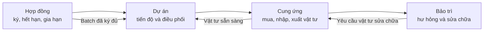

# Mô tả chi tiết và ý nghĩa của 4 dashboard

> Kiểm tra theo working tree ngày 30/07/2026.

## 1. Dashboard là gì và dùng để làm gì?

Dashboard là màn hình tổng hợp dữ liệu nghiệp vụ thành KPI, biểu đồ, bảng đối
chiếu và cảnh báo. Mục đích của dashboard không phải thay thế chứng từ chi tiết,
mà giúp người quản lý trả lời nhanh ba câu hỏi:

1. Tình hình hiện tại như thế nào?
2. Điểm nào đang chậm, thiếu hoặc có rủi ro?
3. Cần mở hồ sơ nào để xử lý tiếp?

Hệ thống DTC BTS có bốn dashboard, tương ứng với bốn góc nhìn quản trị:

| Dashboard | Câu hỏi quản trị chính | Người dùng chính |
| --- | --- | --- |
| Dự án | Dự án nào đúng hạn, có nguy cơ hoặc đã chậm? | GĐXN, KSGS |
| Cung ứng vật tư | Nhu cầu nào đã mua, đã nhập, đã xuất hoặc còn thiếu? | PKH, Thủ kho |
| Bảo trì | Hư hỏng tập trung ở đâu, hạng mục nào và việc nào cần xử lý? | Tổ hạ tầng |
| Hợp đồng | Hợp đồng nào sắp/quá hạn và đối tác nào cần ưu tiên gia hạn? | Tổ hạ tầng, BGĐ hợp đồng |

Các dashboard đọc trực tiếp dữ liệu đang có trong Odoo tại thời điểm mở màn
hình. Vì vậy, chất lượng phân tích phụ thuộc vào việc nhập đúng ngày, trạng
thái, liên kết dự án/trạm, số lượng và kết quả checklist.

## 2. Dashboard dự án

### 2.1. Mục đích và phạm vi dữ liệu

Dashboard **Phân tích tiến độ dự án BTS** cho biết sức khỏe tiến độ của toàn
bộ danh mục dự án. Dashboard lấy các `project.project` có `project_code`;
dự án không có mã không được đưa vào phân tích.

Mốc thời gian chính:

- kế hoạch: `planned_end_date`;
- thực tế khi dự án đã hoàn thành: `acceptance_date`;
- ngày tham chiếu với dự án chưa hoàn thành: ngày hiện tại theo múi giờ người
  dùng.

Số ngày chậm được tính:

```text
Dự án đã hoàn thành = Ngày nghiệm thu - Ngày kết thúc kế hoạch
Dự án chưa hoàn thành = Ngày hiện tại - Ngày kết thúc kế hoạch
```

Kết quả dương là chậm, bằng 0 là đúng ngày và âm là còn sớm so với kế hoạch.
Dự án bị hủy, thiếu ngày kết thúc kế hoạch, hoặc đã hoàn thành nhưng thiếu
ngày nghiệm thu được xếp vào nhóm **Thiếu dữ liệu**.

### 2.2. Ý nghĩa sáu KPI

| KPI | Cách tính | Ý nghĩa quản trị |
| --- | --- | --- |
| Tổng dự án | Số dự án có `project_code` | Quy mô danh mục đang được dashboard theo dõi |
| Đúng tiến độ | Chưa trễ và còn trên 30 ngày; hoặc đã hoàn thành không muộn hơn kế hoạch | Khối lượng công việc đang an toàn về thời gian |
| Nguy cơ ≤ 30 ngày | Dự án chưa hoàn thành, chưa trễ và còn từ 0 đến 30 ngày | Vùng cảnh báo sớm cần rà soát nguồn lực và vướng mắc |
| Đã chậm | Số dự án có số ngày chậm lớn hơn 0 | Số trường hợp cần ưu tiên can thiệp |
| Chậm TB (dự án chậm) | Tổng số ngày chậm / số dự án thuộc nhóm đã chậm | Mức độ nghiêm trọng trung bình; không tính dự án đúng hạn hoặc thiếu dữ liệu |
| Hoàn thành đúng hạn | Dự án hoàn thành đúng hạn / dự án hoàn thành có đủ hai mốc kế hoạch và nghiệm thu | Chất lượng thực hiện lịch sử, không phải tỷ lệ đúng hạn của toàn bộ dự án đang mở |

### 2.3. Ý nghĩa các bảng và biểu đồ

**Dự án cần ưu tiên can thiệp**

- Hiển thị tối đa 12 dự án.
- Thứ tự ưu tiên: **Đã chậm → Nguy cơ ≤ 30 ngày → Thiếu dữ liệu → Đúng tiến
  độ**.
- Trong nhóm đã chậm, dự án chậm nhiều ngày hơn được đưa lên trước.
- Mã dự án là liên kết mở hồ sơ dự án để người dùng kiểm tra và xử lý.

Đây là danh sách hành động nhanh. Nhóm đỏ cần tìm nguyên nhân chậm; nhóm vàng
cần kiểm tra tiến độ trước khi thành quá hạn; nhóm xám cần bổ sung dữ liệu để
dashboard có thể đánh giá đúng.

**Tỷ lệ trạng thái dự án**

Biểu đồ tròn thể hiện cơ cấu theo `state`: hoàn thành, đã phê duyệt, đang thực
hiện, khảo sát, nháp và đã hủy. Biểu đồ này trả lời dự án đang tập trung ở giai
đoạn nghiệp vụ nào; nó khác với phân loại tiến độ đúng hạn/chậm.

**Xu hướng hoàn thành theo tháng**

- Chỉ lấy dự án `done` có đủ `acceptance_date` và `planned_end_date`.
- Hiển thị tối đa 12 tháng có dữ liệu hoàn thành gần nhất.
- Cột xanh là hoàn thành đúng hạn; cột đỏ là hoàn thành chậm.

Biểu đồ dùng để nhận biết chất lượng giao đúng hạn đang cải thiện hay xấu đi
theo thời gian. Tháng không có dự án hoàn thành có thể không xuất hiện.

**Mức chậm trung bình theo khu vực**

Chỉ hiển thị tối đa 10 tỉnh/thành có dự án chậm. Giá trị là số ngày chậm trung
bình của các dự án thuộc nhóm **Đã chậm** tại khu vực đó. Biểu đồ không phải số
ngày chậm trung bình của mọi dự án trong tỉnh.

**Phân tích hiệu quả tiến độ theo khu vực**

Mỗi dòng tỉnh/thành cho biết:

- tổng dự án;
- cơ cấu đúng tiến độ, nguy cơ, đã chậm và thiếu dữ liệu;
- số và tỷ lệ dự án đã chậm;
- số ngày chậm trung bình của riêng các dự án chậm;
- số ngày chậm lớn nhất.

Bảng được ưu tiên theo tỷ lệ chậm, mức chậm trung bình và quy mô dự án. Nhờ đó,
người quản lý có thể phân biệt một khu vực có nhiều dự án nhưng tỷ lệ chậm thấp
với một khu vực ít dự án nhưng rủi ro tập trung cao.

**Chỉ số hiệu quả tiến độ theo KSGS**

Dashboard nhóm dự án theo `project_manager_id`. Các dự án chưa có người phụ
trách nằm trong nhóm **Chưa phân công**.

Chỉ số tham khảo được tính:

```text
Chỉ số = 45% × Tỷ lệ không chậm
       + 35% × Tỷ lệ dự án hoàn thành đúng hạn
       + 20% × Tỷ lệ dự án đủ dữ liệu
```

Trong đó, tỷ lệ hoàn thành đúng hạn chỉ xét dự án hoàn thành có đủ mốc ngày.
Chỉ số giúp phát hiện nơi cần hỗ trợ hoặc làm sạch dữ liệu; không được dùng một
mình để đánh giá nhân sự vì chưa phản ánh độ khó, quy mô và điều kiện thực tế
của từng dự án.

**Thông báo dự án**

Khung thông báo có thể chứa:

- **Vật tư sẵn sàng cấp phát**: yêu cầu vật tư `ready`, chưa đọc, thuộc chính
  người yêu cầu và chưa kết thúc; có nút mở yêu cầu và **Đã xem**.
- **Batch hợp đồng đã ký đủ**: batch `done` mà người dùng nằm trong danh sách
  nhận thông báo; có nút mở batch và **Đã xem**.

Thông báo này đưa kết quả từ Kho và Hợp đồng trở lại đúng màn hình làm việc của
KSGS. Nó không thay thế dashboard cung ứng hoặc dashboard hợp đồng.

### 2.4. Cách sử dụng đề xuất

1. Xử lý danh sách dự án đỏ theo số ngày chậm giảm dần.
2. Rà soát dự án vàng còn không quá 30 ngày, xác định vướng mắc và người chịu
   trách nhiệm.
3. Bổ sung ngày kế hoạch, ngày nghiệm thu hoặc người phụ trách cho nhóm thiếu
   dữ liệu.
4. Dùng bảng khu vực và KSGS để điều phối hỗ trợ, không dùng chỉ số tổng hợp như
   kết luận đánh giá nhân sự.
5. Mở và xác nhận đã xem các thông báo vật tư/batch để đóng vòng phối hợp liên
   phòng ban.

## 3. Dashboard cung ứng vật tư công trình

### 3.1. Mục đích và phạm vi dữ liệu

Dashboard này kiểm soát chuỗi:

```text
Nhu cầu được duyệt → Đã mua → Đã nhập → Đã xuất cho công trình
```

Dashboard lấy các yêu cầu `bts.material.request` không ở trạng thái
`cancelled` hoặc `rejected`, sau đó phân tích các dòng có sản phẩm. Dòng mua
hàng bị hủy không được tính.

Mọi số lượng mua được quy đổi về đơn vị tính của dòng yêu cầu trước khi đối
chiếu. Vì vậy, bảng có thể so sánh đúng trong từng dòng; dashboard không cộng
trực tiếp số lượng của các vật tư có đơn vị khác nhau.

### 3.2. Công thức đối chiếu một dòng vật tư

| Chỉ tiêu | Công thức/nguồn |
| --- | --- |
| Nhu cầu | `quantity_approved` nếu lớn hơn 0; nếu chưa có thì dùng `quantity_requested` |
| Đã mua | Tổng `product_qty` của các dòng PO còn hiệu lực, quy đổi về ĐVT yêu cầu |
| Đã nhập | Tổng `qty_received` của các dòng PO còn hiệu lực, quy đổi về ĐVT yêu cầu |
| Đã xuất | `quantity_issued` trên dòng yêu cầu |
| Còn thiếu | `max(Nhu cầu - Đã nhập, 0)`; chỉ tính sau khi dòng đã được duyệt |
| Chờ xuất | `max(Đã nhập - Đã xuất, 0)` |
| Mua vượt | `max(Đã mua - Nhu cầu, 0)` |

Sai số so sánh dùng độ làm tròn của đơn vị tính (`uom.rounding`, mặc định
`0.01`). Một dòng được xem là **Đã cấp đủ** khi đã duyệt và:

```text
Đã xuất + độ làm tròn ≥ Nhu cầu
```

### 3.3. Ý nghĩa bốn KPI

| KPI | Cách tính | Ý nghĩa quản trị |
| --- | --- | --- |
| Dự án có nhu cầu vật tư | Số dự án khác nhau xuất hiện trong các dòng hợp lệ | Quy mô công trình đang tạo tải cho chuỗi cung ứng |
| Tỷ lệ dòng đã cấp đủ | Số dòng đã cấp đủ / số dòng đã được duyệt | Mức hoàn thành theo chủng loại vật tư; không phải tỷ lệ tổng số lượng |
| Dòng vật tư còn thiếu nhập | Số dòng đã duyệt có `Còn thiếu` từ ngưỡng làm tròn trở lên | Điểm thiếu hàng cần mua hoặc thúc đẩy giao hàng |
| Dòng đã nhập đang chờ xuất | Số dòng có `Chờ xuất` từ ngưỡng làm tròn trở lên | Hàng đã về nhưng chưa đến công trình, cần xử lý cấp phát |

Tỷ lệ được tính theo **dòng**, nên một dòng bulông và một dòng thiết bị lớn có
trọng số như nhau. Cách tính này tránh cộng lẫn đơn vị tính, nhưng không phản
ánh giá trị tiền hoặc mức độ quan trọng của từng vật tư.

### 3.4. Ý nghĩa các bảng và biểu đồ

**Tiến độ cấp phát theo công trình**

Tiến độ của mỗi dòng đã duyệt:

```text
Tiến độ dòng = min(max(Đã xuất / Nhu cầu, 0), 1)
```

Tiến độ dự án là trung bình cộng tiến độ của tất cả dòng thuộc dự án, sau đó
làm tròn thành phần trăm. Dòng chưa duyệt được tính 0%. Dashboard hiển thị tối
đa 12 dự án có tiến độ thấp nhất trước, giúp ưu tiên công trình đang bị nghẽn
vật tư.

**Trạng thái yêu cầu vật tư**

Các yêu cầu được nhóm:

| Nhóm hiển thị | Trạng thái kỹ thuật |
| --- | --- |
| Chờ duyệt | `draft`, `requested`, `postponed` |
| Đang mua / chờ nhập | `approved`, `waiting_purchase`, `purchasing` |
| Chờ xuất / cấp một phần | `ready`, `partially_delivered` |
| Đã cấp đủ | `issued` |

Biểu đồ cho biết khối lượng yêu cầu đang dồn ở bước nào của quy trình, từ đó
phân công đúng cho PKH hoặc Thủ kho.

**Bảng đối chiếu nhu cầu – mua – nhập – xuất**

- Hiển thị tối đa 24 dòng.
- Ưu tiên: thiếu nhập → chờ xuất/đang xử lý → chờ duyệt → đã cấp đủ.
- Trong cùng nhóm, dòng có tổng lượng thiếu và chờ xuất lớn hơn được đưa lên
  trước.
- Trạng thái **Vật tư còn treo** xuất hiện khi dự án đã `done` nhưng vẫn còn
  lượng đã nhập chưa xuất.
- Liên kết trạng thái mở trực tiếp yêu cầu vật tư.

Bảng này là nơi truy nguyên chênh lệch. Ví dụ, **Đã mua** đủ nhưng **Đã nhập**
thiếu là vấn đề giao hàng; **Đã nhập** đủ nhưng **Đã xuất** thiếu là vấn đề cấp
phát kho.

**Cảnh báo lệch chuỗi cung ứng**

Dashboard hiển thị tối đa 10 cảnh báo theo thứ tự dòng ưu tiên:

- công trình còn thiếu vật tư;
- dự án hoàn thành còn vật tư treo;
- đã nhập nhưng chưa cấp đủ;
- số mua vượt nhu cầu.

Mỗi cảnh báo có liên kết mở yêu cầu. Người dùng cần xem chứng từ gốc trước khi
điều chỉnh vì chênh lệch có thể đến từ PO chưa cập nhật nhận hàng, phiếu xuất
chưa Validate hoặc nhu cầu được duyệt thay đổi.

### 3.5. Giới hạn diễn giải

- Đây là dashboard cung ứng cho công trình, không phải báo cáo tối ưu tồn kho,
  vòng quay kho, giá trị tồn hay lợi nhuận.
- **Vật tư sẵn sàng cấp phát** cho KSGS nằm trên dashboard Dự án, không nằm ở
  dashboard này.
- Dashboard phản ánh số lượng nghiệp vụ; không đánh giá mức độ quan trọng hay
  giá trị tiền của từng dòng.

## 4. Dashboard bảo trì

### 4.1. Mục đích và phạm vi dữ liệu

Dashboard **Phân tích hư hỏng và bảo trì BTS** trả lời:

- có bao nhiêu lỗi đã được ghi nhận;
- tỷ lệ phiếu kiểm tra phát hiện lỗi;
- chi phí sửa chữa dự kiến;
- lỗi tập trung ở tỉnh và hạng mục nào;
- công việc bảo trì/sửa chữa nào đang chờ xử lý.

Một **vụ hư hỏng** là một dòng `bts.maintenance.checklist.result` có
`result_state` là `need_repair` hoặc `need_replacement`. Lỗi vẫn được tính sau
khi đã xử lý, vì dashboard dùng dữ liệu lịch sử để phân tích xu hướng.

### 4.2. Ý nghĩa ba KPI phân tích

| KPI | Cách tính | Ý nghĩa quản trị |
| --- | --- | --- |
| Tổng vụ hư hỏng | Tổng dòng checklist cần sửa hoặc thay thế | Khối lượng lỗi lịch sử đã ghi nhận; không phải số trạm hỏng |
| Chi phí sửa dự kiến | Tổng chi phí của mọi đề xuất sửa chữa chưa `cancelled`; ưu tiên `estimated_cost` của đề xuất, nếu bằng 0 thì cộng chi phí các dòng | Quy mô ngân sách dự kiến, không phải chi phí thực chi |
| Tỷ lệ phiếu có hư hỏng | Số phiếu có ít nhất một dòng lỗi / số phiếu có kết quả checklist | Xác suất một lượt kiểm tra phát hiện lỗi; một phiếu nhiều lỗi vẫn chỉ tính một lần ở tử số |

Chi phí hiển thị rút gọn theo `tr` hoặc `tỷ`. Giá trị này không thay thế báo cáo
kế toán và có thể thay đổi khi đề xuất được cập nhật.

### 4.3. Ý nghĩa các biểu đồ

**Xu hướng hư hỏng theo tháng**

- Hiển thị đủ 12 tháng gần nhất, kể cả tháng có 0 lỗi.
- Ngày ghi nhận lỗi ưu tiên: `actual_date` của phiếu; nếu thiếu thì dùng ngày
  bảo trì của batch; cuối cùng dùng `request_date`.
- Mỗi điểm là số dòng checklist lỗi trong tháng.

Đường tăng liên tục cho thấy cần xem lại chất lượng thiết bị, chu kỳ bảo trì
hoặc điều kiện vận hành; một đỉnh đơn lẻ có thể do chiến dịch kiểm tra tập
trung, vì vậy cần mở dữ liệu chi tiết trước khi kết luận.

**Các tỉnh hay hư hỏng nhất**

Biểu đồ xếp tối đa 10 tỉnh/thành theo số dòng checklist lỗi giảm dần. Tỉnh lấy
từ dự án của phiếu bảo trì; thiếu dữ liệu được gom vào **Chưa cập nhật**.

Số lỗi lớn có thể do khu vực có nhiều trạm hoặc nhiều lượt kiểm tra hơn. Biểu
đồ thể hiện số tuyệt đối, chưa chuẩn hóa theo số trạm.

**Hạng mục hay hư hỏng nhất**

Biểu đồ xếp tối đa 8 hạng mục checklist theo số lỗi. Nó giúp xác định thiết bị
hoặc hạng mục cần:

- điều chỉnh chu kỳ kiểm tra;
- chuẩn bị vật tư dự phòng;
- xem lại tiêu chuẩn kỹ thuật hoặc nhà cung cấp;
- đào tạo kỹ thuật viên về lỗi lặp lại.

### 4.4. Cảnh báo và công việc bảo trì

Khung này lấy các công việc có khả năng cần hành động, sắp xếp cảnh báo đỏ
trước vàng, theo ngày và tên; màn hình phân tích hiển thị tối đa 8 mục.

Các nhóm thông báo:

- **Dự án đến hạn bảo trì**: hồ sơ thiết bị đang hoạt động, còn được quản lý,
  có trạm và `next_action_date <= ngày hiện tại`. Nếu dự án đã có phiếu bảo trì
  mở thì không tạo thêm thông báo đến hạn cho dự án đó.
- **Phiếu bảo trì mở**: batch ở `draft`, `generated`, `in_progress`,
  `submitted` hoặc `reviewed`.
- **Đề xuất sửa chữa mở**: `draft`, `confirmed`, `waiting_material`,
  `ready_to_repair` hoặc `repairing`.
- **Chờ tiếp nhận bàn giao**: dự án có `maintenance_handover_state = pending`.

Màu đỏ thường biểu thị quá hạn hoặc hư hỏng cần chú ý; màu vàng biểu thị công
việc đang chờ bước tiếp theo. Mỗi thông báo có thể mở hồ sơ tương ứng.

Nhắc trước bảo trì ba ngày là `mail.activity`, không phải KPI đến hạn của
dashboard. KPI/cảnh báo đến hạn chỉ tính khi đã tới ngày
`next_action_date`.

### 4.5. Cách sử dụng đề xuất

1. Xử lý dự án quá hạn và đề xuất sửa chữa đỏ trước.
2. Điều phối các phiếu đang thực hiện, chờ kiểm tra hoặc chờ hoàn tất.
3. Theo dõi đề xuất `waiting_material` cùng dashboard cung ứng để gỡ nghẽn vật
   tư.
4. Dùng xếp hạng tỉnh và hạng mục để lập kế hoạch phòng ngừa, nhưng đối chiếu
   thêm số trạm và số lượt kiểm tra trước khi kết luận tỷ lệ hỏng cao.
5. Đối chiếu chi phí dự kiến với hồ sơ sửa chữa; không coi đó là chi phí kế
   toán đã phát sinh.

## 5. Dashboard hợp đồng

### 5.1. Mục đích và phạm vi dữ liệu

Dashboard **Phân tích thời hạn hợp đồng BTS** tập trung vào rủi ro hết hạn và
gia hạn. Phần phân tích thời hạn chỉ lấy hợp đồng:

- có `expiration_date`;
- ở trạng thái `active`, `renewal_agreed` hoặc `expired`.

Số ngày còn lại:

```text
Số ngày còn lại = Ngày hết hạn - Ngày hiện tại
```

Dashboard phân nhóm:

| Nhóm | Điều kiện |
| --- | --- |
| Quá hạn | Số ngày còn lại < 0 |
| Dưới 60 ngày | Từ 0 đến 59 ngày |
| 60–90 ngày | Từ 60 đến 90 ngày |
| Trên 90 ngày | Trên 90 ngày |

Các mốc này phục vụ phân tích danh mục. Chúng khác cửa sổ KPI nghiệp vụ
**Sắp hết hạn** cố định 0–30 ngày và khác trường `alert_before_days` dùng tạo
deadline của `mail.activity`.

### 5.2. Ý nghĩa các biểu đồ và bảng

**Số hợp đồng theo mốc hạn**

Biểu đồ cho biết hợp đồng đang phân bố ở bốn vùng thời gian. Nhóm **Quá hạn**
cần xử lý ngay; nhóm **Dưới 60 ngày** cần kiểm tra hồ sơ gia hạn; nhóm
**60–90 ngày** là vùng chuẩn bị thương lượng; nhóm **Trên 90 ngày** là danh
mục theo dõi dài hạn.

**Bản đồ nhiệt hợp đồng theo tỉnh × hạn**

- Hàng là tỉnh/thành lấy từ dự án của hợp đồng.
- Cột là nhóm thời hạn.
- Màu đậm hơn nghĩa là số hợp đồng trong ô lớn hơn.
- Có tổng theo hàng, tổng theo cột và tổng số hợp đồng có ngày hết hạn hợp lệ.

Ma trận giúp xác định nơi có nhiều hợp đồng đồng loạt đến hạn để phân bổ nguồn
lực thương lượng. Ô lớn không tự động có nghĩa là rủi ro cao hơn nếu khu vực đó
có quy mô trạm lớn.

**Đối tác cần ưu tiên gia hạn**

- Chỉ tính hợp đồng quá hạn hoặc còn không quá 90 ngày.
- Nhóm theo `partner_id`.
- Hiển thị tối đa 10 đối tác có số hợp đồng cần ưu tiên lớn nhất.

Biểu đồ hỗ trợ gom hồ sơ và tổ chức thương lượng theo đối tác thay vì xử lý rời
rạc từng hợp đồng.

**Cảnh báo: đất hết hạn sớm hơn hạ tầng**

Bảng liệt kê tối đa 20 hợp đồng `infrastructure_lease` khi:

- có liên kết hợp đồng thuê đất;
- cả hai hợp đồng có ngày hết hạn;
- ngày hết hạn hợp đồng đất sớm hơn hợp đồng hạ tầng;
- hợp đồng hạ tầng chưa `cancelled` hoặc `liquidated`.

Đây là rủi ro phụ thuộc: quyền sử dụng đất có thể hết trước thời gian cam kết
cho thuê hạ tầng. Mã hợp đồng đất và hạ tầng đều mở được hồ sơ chi tiết để xử
lý.

### 5.3. Cảnh báo và công việc hợp đồng

Khung thông báo hiển thị tối đa 8 mục có độ ưu tiên cao nhất. Nội dung có thể
gồm:

- hồ sơ gia hạn `pending_signature` chờ BGĐ ký số hoặc từ chối;
- hợp đồng `active` đã quá hạn;
- hợp đồng `active` còn từ 0 đến 30 ngày;
- hợp đồng `renewal_agreed` cần lập hồ sơ gia hạn;
- gia hạn `in_progress`;
- biên bản đàm phán `pending_approval`;
- hợp đồng `submitted` chờ ký duyệt.

Thông báo gia hạn chờ ký chỉ được đưa vào dữ liệu của BGĐ hợp đồng hoặc System
Administrator; Tổ hạ tầng thấy các hồ sơ đang thực hiện theo quyền của mình.
Mỗi mục có liên kết mở chứng từ để tiếp tục quy trình.

Lưu ý: cron có thể đã chuyển hợp đồng quá ngày hết hạn từ `active` sang
`expired`. Phần biểu đồ vẫn đưa `expired` vào nhóm **Quá hạn**, trong khi thông
báo “Hợp đồng đã quá hạn” chỉ được tạo cho bản ghi còn ở `active`. Vì vậy, biểu
đồ là góc nhìn danh mục còn khung thông báo là danh sách công việc theo trạng
thái.

### 5.4. Cách sử dụng đề xuất

1. Xử lý hồ sơ chờ ký và hợp đồng quá hạn trước.
2. Với nhóm dưới 60 ngày, kiểm tra đã có hồ sơ gia hạn, file scan và người phụ
   trách hay chưa.
3. Gom kế hoạch thương lượng theo đối tác và tỉnh/thành có mật độ đến hạn cao.
4. Xử lý ngay chênh lệch hạn đất–hạ tầng trước khi ký gia hạn hạ tầng.
5. Không nhầm nhóm dưới 60 ngày của biểu đồ với KPI sắp hết hạn 30 ngày hoặc
   deadline activity theo `alert_before_days`.

## 6. Cách đọc liên kết giữa bốn dashboard

Bốn dashboard mô tả cùng một vòng đời nhưng ở các góc nhìn khác nhau:



Ví dụ cách truy nguyên:

- Dự án chậm trên dashboard Dự án có thể liên quan đến dòng **Thiếu nhập** hoặc
  **Chờ xuất** trên dashboard Cung ứng.
- Đề xuất sửa chữa `waiting_material` trên dashboard Bảo trì cần được theo dõi
  tiếp trong dashboard Cung ứng.
- Batch hợp đồng hoàn tất trên dashboard Hợp đồng tạo thông báo cho KSGS trên
  dashboard Dự án.
- Hợp đồng sắp hết hạn theo tỉnh có thể được ưu tiên cùng kế hoạch bảo trì để
  tránh đầu tư sửa chữa lớn vào hồ sơ pháp lý chưa ổn định.

## 7. Nguyên tắc sử dụng dashboard

1. Dashboard là công cụ phát hiện và ưu tiên, không phải chứng từ pháp lý hoặc
   kế toán.
2. Luôn mở bản ghi gốc trước khi thay đổi trạng thái hoặc ra quyết định.
3. Không cộng hoặc so sánh trực tiếp số lượng vật tư khác đơn vị tính.
4. Phân biệt rõ số tuyệt đối với tỷ lệ; vùng có nhiều dự án/trạm thường có số
   lỗi hoặc hợp đồng đến hạn cao hơn.
5. Bổ sung dữ liệu thiếu đúng thời điểm, đặc biệt là ngày kế hoạch, ngày nghiệm
   thu, ngày hết hạn, tỉnh/thành, KSGS, số lượng duyệt và ngày bảo trì.
6. Khi số liệu có vẻ chưa đúng, kiểm tra trạng thái chứng từ, liên kết
   dự án/trạm, PO bị hủy, phiếu kho chưa Validate và lịch cron trước khi kết
   luận dashboard sai.
